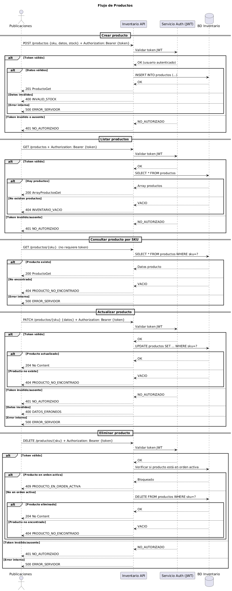
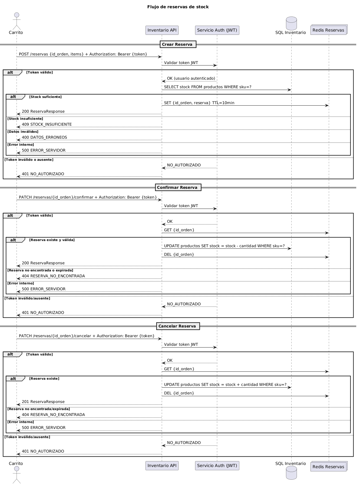
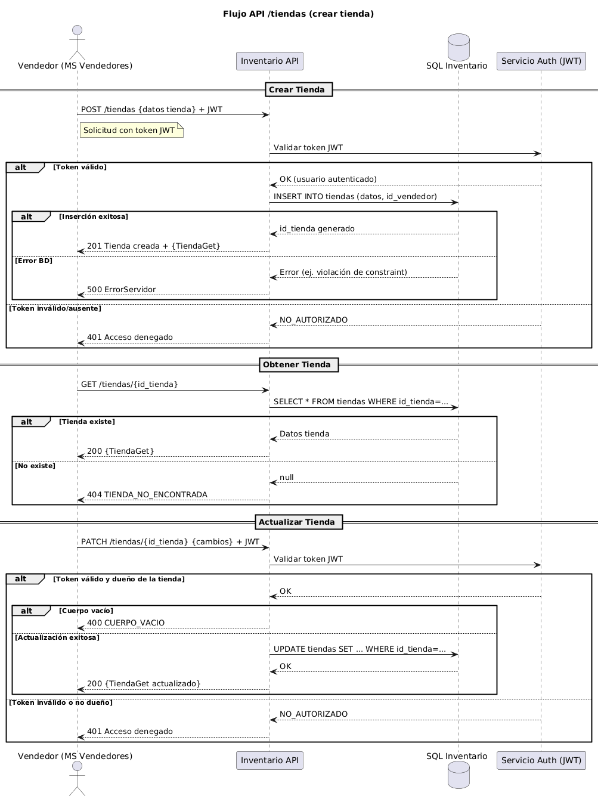
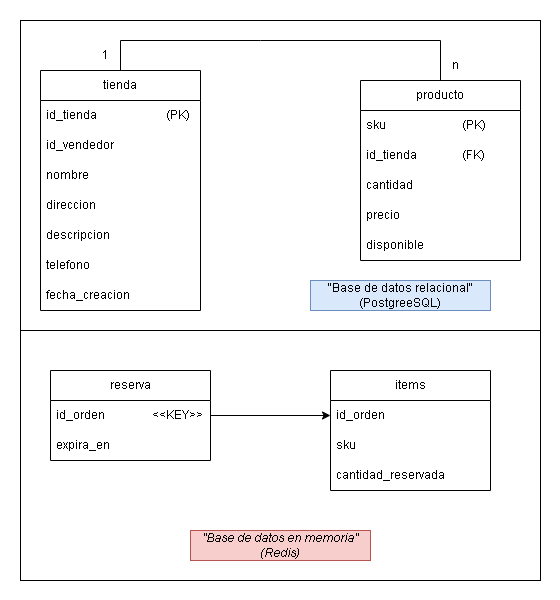

# API Inventario - Pulga Shop

## 📖 Documentación de la API

La especificación completa de la API se encuentra documentada en OpenAPI 3.0 y está disponible en múltiples formatos:

- **Especificación OpenAPI:** [`docs/docs.yaml`](./docs/docs.yaml)
- **Documentación interactiva:** [API Inventario (HTML)](https://catrilao.github.io/pulga-shop-inventario-backend/#/)
- **Swagger UI local:** [http://localhost:3000/docs](http://localhost:3000/docs) *(cuando el servidor esté ejecutándose)*

## 🚀 Endpoints Principales

### 📦 Productos
- `POST /productos` → Añadir producto y setear stock inicial
- `GET /productos` → Listar todos los productos con filtros opcionales
- `GET /productos/{sku}` → Consultar producto específico por SKU
- `PATCH /productos/{sku}` → Actualizar información del producto
- `DELETE /productos/{sku}` → Eliminar producto del inventario

### 📋 Reservas
- `POST /reservas` → Reservar stock (inicio del proceso de checkout)
- `PATCH /reservas/{id_orden}/confirmar` → Confirmar reserva tras pago exitoso
- `PATCH /reservas/{id_orden}/cancelar` → Cancelar reserva y liberar stock

### 🏪 Tiendas
- `POST /tiendas` → Crear nueva tienda con vendedor asociado
- `GET /tiendas/{id_tienda}` → Obtener información completa de una tienda
- `PATCH /tiendas/{id_tienda}` → Actualizar datos de la tienda

## 📊 Diagramas y Arquitectura

### Diagramas de Flujo

#### 📦 Flujo de Productos
Gestión del inventario y productos



#### 📋 Flujo de Reservas
Proceso de reserva y confirmación de stock



#### 🏪 Flujo de Tiendas
Gestión de tiendas y vendedores asociados



### Modelo de Base de Datos

#### 🗄️ Modelo Relacional
Estructura de la base de datos MySQL



## 🗄️ Base de Datos

### Arquitectura Híbrida
El sistema utiliza una arquitectura de base de datos híbrida:
- **MySQL**: Almacenamiento persistente de tiendas y productos
- **Redis**: Gestión temporal de reservas con expiración automática

### Estructura de Datos

#### Base de Datos Relacional (MySQL)

**Tabla: `tienda`**
| Atributo | Tipo | Nulo | Clave | Descripción |
|----------|------|------|-------|-------------|
| `id_tienda` | INT AUTO_INCREMENT | NO | PK | Identificador único de la tienda |
| `id_vendedor` | BIGINT | NO | - | Referencia al vendedor dueño (módulo externo) |
| `nombre` | VARCHAR(100) | NO | - | Nombre de la tienda |
| `direccion` | VARCHAR(200) | NO | - | Dirección física de la tienda |
| `descripcion` | text | NO | - |  Descripcion de la tienda |
| `telefono` | VARCHAR(20) | NO | - | Teléfono de contacto |
| `fecha_creacion` | DATE | NO | - | Fecha de registro en el sistema |

**Tabla: `producto`**
| Atributo | Tipo | Nulo | Clave | Descripción |
|----------|------|------|-------|-------------|
| `sku` | VARCHAR | NO | PK | Identificador único del producto |
| `id_tienda` | INT | NO | FK | Tienda propietaria del producto |
| `cantidad` | INT | NO | - | Stock disponible en inventario |
| `precio` | INT | NO | - | Precio de venta del producto |
| `disponible` | BOOL | NO | - | Disponibilidad del producto |

#### Base de Datos en Memoria (Redis)

**Estructura: `reserva`**
| Atributo | Tipo | Tipo Redis | Descripción |
|----------|------|------------|-------------|
| `id_orden` | STRING | KEY | Identificador único de la reserva |
| `expira_en` | DATETIME | VALUE | Tiempo de expiración de la reserva |

**Estructura: `items`**
| Atributo | Tipo | Tipo Redis | Descripción |
|----------|------|------------|-------------|
| `id_orden` | STRING | VALUE | Identificador de la reserva |
| `sku` | STRING | VALUE | Producto reservado |
| `cantidad_reservada` | INTEGER | VALUE | Cantidad apartada para la orden |

## 🔧 Instalación y Configuración

### Prerrequisitos
- Node.js (v16 o superior)
- MySQL Server
- Redis Server

### Variables de Entorno
Crea un archivo `.env` basado en `.env.example`:

```bash
# Base de datos MySQL
DB_HOST=localhost
DB_PORT=3306
DB_NAME=pulga_shop_inventario
DB_USER=your_username
DB_PASSWORD=your_password

# Redis
REDIS_HOST=localhost
REDIS_PORT=6379
REDIS_PASSWORD=your_redis_password

# Servidor
PORT=3000
NODE_ENV=development
```

### Ejecución
```bash
# Instalar dependencias
npm install

# Ejecutar migraciones de base de datos
npm run migrate

# Modo desarrollo
npm run dev

# Modo producción
npm start
```

## 🧪 Testing

```bash
# Ejecutar tests
npm test

# Tests con coverage
npm run test:coverage

# Tests en modo watch
npm run test:watch
```

---

📚 **Para más detalles:** Consulta la [documentación completa de la API](https://catrilao.github.io/pulga-shop-inventario-backend/#/) o revisa la especificación OpenAPI en [`docs/docs.yaml`](./docs/docs.yaml).

---


# Backend NestJS para GPI Template - Universidad de Valparaíso

Este proyecto es un backend desarrollado con NestJS y MongoDB para el template GPI de la Universidad de Valparaíso. El backend proporciona una API RESTful que se integra con el frontend React, ofreciendo funcionalidades de autenticación y gestión de usuarios.

## 🚀 Tecnologías

Este backend utiliza las siguientes tecnologías:

- **NestJS**: Framework progresivo para construir aplicaciones del lado del servidor
- **TypeScript**: Superset tipado de JavaScript
- **MongoDB**: Base de datos NoSQL orientada a documentos
- **Mongoose**: Biblioteca ODM (Object Data Modeling) para MongoDB
- **JWT**: JSON Web Tokens para autenticación
- **Passport**: Middleware para autenticación
- **Class Validator**: Validación de datos basada en decoradores
- **bcrypt**: Librería para hashear contraseñas

## 📁 Estructura de Carpetas

```
backend/
├── src/
│   ├── app.module.ts                # Módulo principal
│   ├── main.ts                      # Punto de entrada
│   ├── config/                      # Configuraciones
│   │   ├── database.config.ts       # Configuración de MongoDB
│   │   ├── jwt.config.ts            # Configuración de JWT
│   │   └── env.config.ts            # Variables de entorno
│   ├── auth/                        # Módulo de autenticación
│   │   ├── auth.module.ts           # Módulo de autenticación
│   │   ├── auth.controller.ts       # Controlador
│   │   ├── auth.service.ts          # Servicio
│   │   ├── dto/                     # DTOs para validación
│   │   │   ├── login.dto.ts         # Login DTO
│   │   │   └── register.dto.ts      # Registro DTO
│   │   ├── guards/                  # Guards para proteger rutas
│   │   │   └── jwt-auth.guard.ts    # Guard de JWT
│   │   └── strategies/              # Estrategias de Passport
│   │       └── jwt.strategy.ts      # Estrategia JWT
│   ├── users/                       # Módulo de usuarios
│   │   ├── users.module.ts          # Módulo de usuarios
│   │   ├── users.controller.ts      # Controlador
│   │   ├── users.service.ts         # Servicio
│   │   ├── schemas/                 # Esquemas de MongoDB
│   │   │   └── user.schema.ts       # Esquema de usuario
│   │   └── dto/                     # DTOs
│   │       ├── create-user.dto.ts   # DTO para crear usuario
│   │       └── update-user.dto.ts   # DTO para actualizar usuario
│   └── common/                      # Código compartido
├── .env                             # Variables de entorno
├── nest-cli.json                    # Configuración de NestJS CLI
├── package.json                     # Dependencias
└── tsconfig.json                    # Configuración de TypeScript
```

## 🏗️ Arquitectura

### Módulos

El backend está organizado en módulos, siguiendo las mejores prácticas de NestJS:

- **AppModule**: Módulo raíz que importa el resto de módulos
- **AuthModule**: Gestiona la autenticación y autorización
- **UsersModule**: Gestiona las operaciones CRUD de usuarios

### Patrón de Arquitectura

La aplicación sigue una arquitectura en capas:

- **Controladores**: Gestionan las solicitudes HTTP y respuestas
- **Servicios**: Contienen la lógica de negocio
- **Repositorios**: Interactúan con la base de datos (a través de Mongoose)

### Sistema de Autenticación

La autenticación está implementada usando JWT (JSON Web Tokens):

1. El usuario se registra o inicia sesión
2. El servidor valida las credenciales y genera un token JWT
3. El cliente almacena el token y lo incluye en cada solicitud
4. Los guards verifican el token para proteger las rutas

## ⚙️ Instalación y Configuración

### Requisitos Previos

- Node.js (versión recomendada: 18.x o superior)
- pnpm (sigue las instrucciones de instalación del README del frontend)
- MongoDB (instalado localmente o una instancia en la nube como MongoDB Atlas)

### Instalación

1. Clona este repositorio:
   ```bash
   git clone <url-del-repositorio>
   cd backend
   ```

2. Instala las dependencias con pnpm:
   ```bash
   pnpm install
   ```

3. Crea un archivo `.env` en la raíz del proyecto con el siguiente contenido:
   ```
   NODE_ENV=development
   PORT=3000
   MONGODB_URI=mongodb://localhost:27017/gpi_database
   JWT_SECRET=EstoEsUnSecretoSuperSeguroParaElCursoGPI
   JWT_EXPIRES_IN=1d
   ```

4. Asegúrate de que MongoDB esté en ejecución:
   - **Windows**: Inicia el servicio MongoDB
   - **macOS**: `brew services start mongodb-community`
   - **Linux**: `sudo systemctl start mongod`

### Ejecución

- **Desarrollo**:
  ```bash
  pnpm start:dev
  ```
  Esto iniciará el servidor en modo desarrollo con recarga automática en `http://localhost:3000/api`

- **Producción**:
  ```bash
  pnpm build
  pnpm start:prod
  ```

## 🌐 API Endpoints

### Autenticación

- **POST /api/auth/register**: Registrar un nuevo usuario
  ```json
  {
    "name": "John",
    "lastName": "Doe",
    "email": "john.doe@example.com",
    "password": "password123"
  }
  ```

- **POST /api/auth/login**: Iniciar sesión
  ```json
  {
    "email": "john.doe@example.com",
    "password": "password123"
  }
  ```

- **GET /api/auth/me**: Obtener información del usuario autenticado (requiere token JWT)

### Usuarios

- **GET /api/users**: Obtener todos los usuarios (requiere token JWT)
- **GET /api/users/:id**: Obtener un usuario por ID (requiere token JWT)
- **PATCH /api/users/:id**: Actualizar un usuario (requiere token JWT)
- **DELETE /api/users/:id**: Eliminar un usuario (requiere token JWT)

## 🔄 Integración con el Frontend

Para integrar este backend con el frontend React:

1. En el frontend, asegúrate de que los servicios en `src/db/services` apunten a la URL correcta del backend:
   ```typescript
   // src/db/config/api.ts
   import axios from 'axios';

   export const api = axios.create({
     baseURL: import.meta.env.VITE_API_URL || 'http://localhost:3000/api',
     timeout: 10000,
     headers: {
       'Content-Type': 'application/json'
     }
   });

   // Interceptor para añadir el token de autenticación
   api.interceptors.request.use(config => {
     const token = localStorage.getItem('token');
     if (token) {
       config.headers.Authorization = `Bearer ${token}`;
     }
     return config;
   });
   ```

2. Los hooks de autenticación en el frontend deben usar los endpoints correspondientes:
   ```typescript
   // Ejemplo de login en el frontend
   const login = async (email, password) => {
     try {
       const response = await api.post('/auth/login', { email, password });
       localStorage.setItem('token', response.data.access_token);
       return response.data.user;
     } catch (error) {
       throw new Error('Error de autenticación');
     }
   };
   ```

## 🧠 Conceptos Clave para Estudiantes

### DTO (Data Transfer Object)

Los DTOs definen la estructura de los datos que se reciben en las solicitudes HTTP:

```typescript
export class CreateUserDto {
  @IsNotEmpty()
  @IsString()
  name: string;

  @IsNotEmpty()
  @IsString()
  lastName: string;

  @IsNotEmpty()
  @IsEmail()
  email: string;

  @IsNotEmpty()
  @IsString()
  @MinLength(6)
  password: string;
}
```

Los decoradores como `@IsNotEmpty()` y `@IsEmail()` validan automáticamente los datos recibidos.

### Esquemas de Mongoose

Definen la estructura de los documentos en MongoDB:

```typescript
@Schema({ timestamps: true })
export class User {
  @Prop({ required: true })
  name: string;

  @Prop({ required: true })
  lastName: string;

  @Prop({ required: true, unique: true })
  email: string;

  @Prop({ required: true })
  password: string;

  @Prop({ default: 'user' }) // 'admin' o 'user'
  role: string;

  @Prop({ default: true })
  isActive: boolean;
}
```

### Guards

Protegen las rutas y verifican permisos:

```typescript
@UseGuards(JwtAuthGuard)
@Get()
findAll() {
  return this.usersService.findAll();
}
```

### Inyección de Dependencias

NestJS utiliza inyección de dependencias para gestionar servicios y componentes:

```typescript
@Injectable()
export class AuthService {
  constructor(
    private usersService: UsersService,
    private jwtService: JwtService,
  ) {}

  // ...
}
```

## 🛠️ Personalización y Extensión

### Añadir un Nuevo Módulo

1. Crea una nueva carpeta con la estructura de módulo dentro de `src/`
2. Define el esquema, DTOs, controlador y servicio
3. Importa el módulo en `app.module.ts`

### Añadir un Nuevo Endpoint

1. Añade un nuevo método en el controlador correspondiente
2. Implementa la lógica en el servicio
3. Define los DTOs necesarios para la validación

### Añadir un Nuevo Guard

1. Crea un nuevo guard en `src/common/guards` o en el módulo específico
2. Implementa la lógica de autorización
3. Aplica el guard a nivel de controlador o ruta

## ⚠️ Notas Importantes

- Este backend está diseñado para desarrollo local. Para producción, se deben implementar medidas de seguridad adicionales.
- El secreto JWT debe mantenerse seguro y cambiarse en un entorno de producción.
- Las contraseñas se almacenan hasheadas, pero se pueden implementar políticas más estrictas.
- La conexión a MongoDB está configurada para una instancia local. Para producción, considera usar MongoDB Atlas u otro servicio en la nube.

---

Desarrollado para la asignatura de Gestión de Proyecto Informático - Diego Monsalves - René Noël - Universidad de Valparaíso
